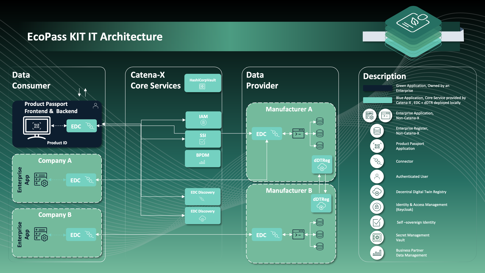
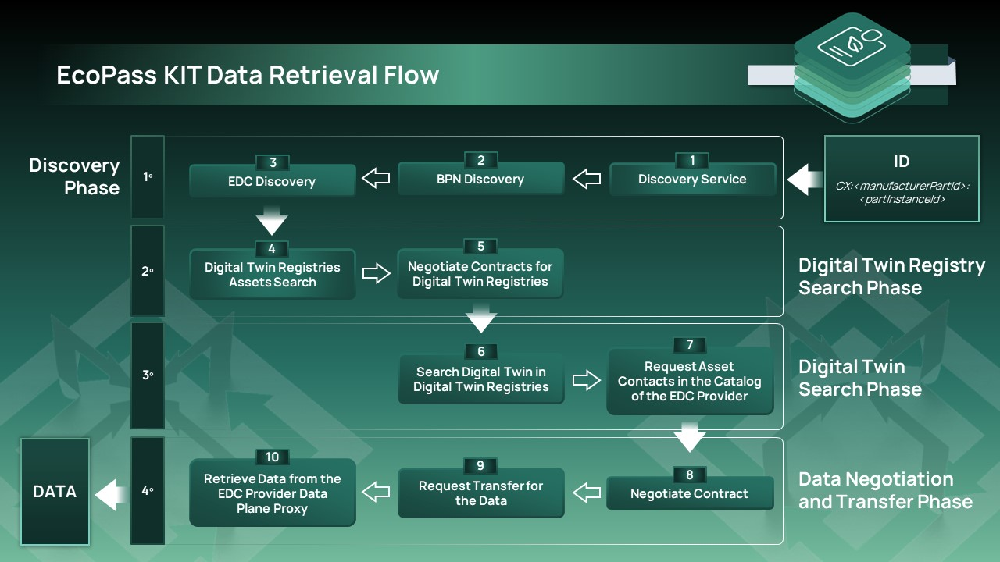

## Introduction

### General Development Information

The developer view provides developers with resources to utilize the EcoPass KIT effectively. On the one side developers can learn how to integrate the EcoPass KIT into their applications and to make use of the product passport exchanging feature via the Catena-X network. On the other side, IT-Administrators will learn how to provide the needed passport data and which components are required.
Thereby, this KIT covers various aspects, starting from how the available API Endpoints can be utilized for data models and how to make them available in the Catena-x Data Space.

### Architecture Overview

The following Figure shows how the EcoPass KIT (represented by Digital Product Passport Frontend and Backend) is embedded in the overall architecture.

## Data Retrieval Flow

Here is a diagram of the data retrial flow necessary to retrieve any data from the Catena-X Network without any optimizations:

### 1. Discovery Phase

At the beginning we start calling the `Discovery Service` which is responsible for giving us the urls from the `BPN Discovery` and the `EDC Discovery` this two service give us first a `BPN or Business Partner Number` for a specific `id` and the `EDC Discovery` will give you a list of EDC registered by one company's `BPN`.

### 2. Digital Twin Registry Search Phase

Once we have a list of `EDCs` we need to find which of this EDCs contain the `Digital Twin Registry` component. We can filter which `EDCs` contain the `Digital Twin Registry` by simply calling for the catalog with the `type` condition of the contract that must have the `data.core.digitalTwinRegistry` standardized type. 

Once we have the list of DTRs we need to negotiate each contract retrieve in the catalog so that we can have the `Contract Agreement Id` which is given by the EDC once the contact is signed and agreed. This id will be used later to request the transfer for the `EDR` token for accessing the `Digital Twin Registry` through the `EDC Provider Data Plane Proxy`. 

### 3. Digital Twin Search Phase

We need to search for the `Digital Twins` inside of the `Digital Twin Registries`, and once we found it we can start the negotiation for the `submodelDescriptor` we are searching for that can be for example a: `Digital Product Pass`, `Battery Pass`, `Single Level BOM as Built` or a `Transmission Pass`.

### 4. Data Negotiation and Transfer Phase

Once we have the submodel we are going to call the [`subprotocolBody`](#L233) url of the `endpoint interface` with name `SUBMODEL-3.0`. This will provide for us the asset id to negotiate with the EDC Provider. Once this asset is negotiated we will request for the `transfer` and `EDR` token will be sent to the backend by the EDC Provider, allowing us to query the dataplane url contained in the `href` field of the endpoint interface. And in this way we will retrieve the data using the `EDC Provider Data Plane Proxy`.

#### API calls

| Call   | Method | Path                                               | Params                                     |
| ------ | ------ | -------------------------------------------------- | ------------------------------------------ |
| [001]  | POST   | /api/administration/connectors/discovery/search    | key:ManufactureID                          |
| [003]  | POST   | /api/administration/connectors/bpnDiscovery/search | key:ManufactureID                          |
| [005]  | POST   | /api/administration/connectors/discovery/search    | `{[<Company's BPNL>]}`                     |
| [0012] | GET    | /lookup/shells                                     | key:partInstanceID, value: batteryDMC-Code |

## API Specification

| Service Name          | Description                                                                            | Reference Implementation                                                                            | Standardization Number                                                                                                                                                                   |
| --------------------- | -------------------------------------------------------------------------------------- | --------------------------------------------------------------------------------------------------- | ---------------------------------------------------------------------------------------------------------------------------------------------------------------------------------------- |
| Portal/IAM            | Portal                                                                                 | [Portal](https://github.com/eclipse-tractusx/portal-backend)                                        | [CX - 0015](https://catena-x.net/fileadmin/user_upload/Standard-Bibliothek/Update_PDF_Maerz/4_IAM/CX_-_0015_IAM___Access_Control_Paradigm_PlatformCapabilityIAM_v_1.0.1.pdf)             |
| Discovery Finder      | A microservice resolving a type of identifiers against a set of BPN-Discovery Servers. | [Tractus-X Discovery Finder](https://github.com/eclipse-tractusx/sldt-discovery-finder)             | [CX - 0053](https://catena-x.net/fileadmin/user_upload/Standard-Bibliothek/Archiv/Update_Juli_23_R_3.2/CX-0053-BPNDiscoveryServiceAPIs.pdf)                                              |
| BPN Discovery Service | A microservice resolving a particular assetId against the registered BPN of its owner. | [Tractus-X BPN Discovery](https://github.com/eclipse-tractusx/sldt-bpn-discovery)                   | [CX - 0053](https://catena-x.net/fileadmin/user_upload/Standard-Bibliothek/Archiv/Update_Juli_23_R_3.2/CX-0053-BPNDiscoveryServiceAPIs.pdf)                                              |
| EDC Discovery Service | A microservice that resolves a BPN against an EDC endpoint.                            | [Tractus-X Portal including EDC Discovoery API](https://github.com/eclipse-tractusx/portal-backend) | [CX - 0001](https://catena-x.net/fileadmin/user_upload/Standard-Bibliothek/Update_PDF_Maerz/9_Data-Discovery-Services/CX_-_0001_EDC_DISCOVERY_API_PlatformCapabilityDS_v_1.0.1-1.pdf)    |
| EDC                   | Eeclipse Dataspace Connector                                                           | [Tractus-X EDC](https://github.com/eclipse-tractusx/tractusx-edc)                                   | [CX - 0018](https://catena-x.net/fileadmin/user_upload/Standard-Bibliothek/Update_PDF_Maerz/3_Sovereign_Data_Exchange/CX_-_0018_EDC_PlatformCapabilitySovereignDataExchange_v_1.0.1.pdf) |

Please note: In order to provide a passport asset for consumption a corresponding offer must exist. Please refer to “[Setup Data Offer](https://github.com/eclipse-tractusx/tractusx-edc/blob/main/docs/samples/Transfer%20Data.md#2-setup-data-offer)” in the EDC documentation.

## Reference Implementationfernce

A reference implementation and a corresponding documentation can be found [here](https://github.com/eclipse-tractusx/digital-product-pass/tree/main).

This reference includes a frontend and a backend allowing users to look up and display Battery Passport assets.
The Helm charts of this reference implementation are located [here](https://github.com/eclipse-tractusx/digital-product-pass/tree/main/charts/digital-product-pass).

### Documentation in the context development

The following represents a collection of relevant documentation regarding the presented adaptation and all related services:

**[EDC Domain Model](https://github.com/eclipse-edc/Connector/blob/main/docs/developer/architecture/domain-model.md)**

**[Reference Implementation (+Arch42)](https://github.com/eclipse-tractusx/digital-product-pass/tree/main/docs)**

## NOTICE

This work is licensed under the [CC-BY-4.0](https://creativecommons.org/licenses/by/4.0/legalcode).

- SPDX-License-Identifier: CC-BY-4.0
- SPDX-FileCopyrightText: 2023,2023 ZF Friedrichshafen AG
- SPDX-FileCopyrightText: 2023,2023 Robert Bosch GmbH
- SPDX-FileCopyrightText: 2023,2023 Bayerische Motoren Werke Aktiengesellschaft (BMW AG)
- SPDX-FileCopyrightText: 2023,2023 T-Systems International GmbH
- SPDX-FileCopyrightText: 2023,2023 SAP SE
- SPDX-FileCopyrightText: 2023,2023 Fraunhofer-Gesellschaft zur Förderung der angewandten Forschung e.V. für ihre Institute IPK und IPK
- SPDX-FileCopyrightText: 2023,2023 BASF SE
- SPDX-FileCopyrightText: 2023,2023 Henkel AG & Co. KGaA
- SPDX-FileCopyrightText: 2023,2023 Contributors to the Eclipse Foundation
- Source URL: <https://github.com/eclipse-tractusx/eco-pass-kit>
