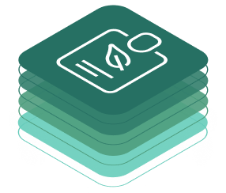

<!-- 
#################################################################################
Tractus-X - Eco Pass KIT

Copyright (c) 2022, 2023 Contributors to the Eclipse Foundation

See the NOTICE file(s) distributed with this work for additional
Information regarding copyright ownership.

This program and the accompanying materials are made available under the
terms of the Apache License, Version 2.0 which is available at

https://www.apache.org/licenses/LICENSE-2.0.

Unless required by applicable law or agreed to in writing, software
distributed under the License is distributed on an "AS IS" BASIS
WITHOUT WARRANTIES OR CONDITIONS OF ANY KIND,
either express or implied. See the
License for the specific language govern in permissions and limitations
under the License.

SPDX-License-Identifier: Apache-2.0
################################################################################## 
-->



# Eco Pass KIT

Based on the information provided in this kit, it is possible to run and program against an infrastructure of Digital Product Pass the Catena-X-way. This infrastructure empowers Data Consumers to consume the network's data as agreed with each Data Provider and facilitated by an Operating Company. They run central and decentral services that allow them to discover each other, exchange information and contextualize it according to a standardized semantics.

| Service Name          | Description                                                                            | Reference Implementation                                                                            | Standardization Number                                                                                                                                                                   |
| --------------------- | -------------------------------------------------------------------------------------- | --------------------------------------------------------------------------------------------------- | ---------------------------------------------------------------------------------------------------------------------------------------------------------------------------------------- |
| Portal/IAM            | Portal                                                                                 | [Portal](https://github.com/eclipse-tractusx/portal-backend)                                        | [CX - 0015](https://catena-x.net/fileadmin/user_upload/Standard-Bibliothek/Update_PDF_Maerz/4_IAM/CX_-_0015_IAM___Access_Control_Paradigm_PlatformCapabilityIAM_v_1.0.1.pdf)             |
| Discovery Finder      | A microservice resolving a type of identifiers against a set of BPN-Discovery Servers. | [Tractus-X Discovery Finder](https://github.com/eclipse-tractusx/sldt-discovery-finder)             | [CX - 0053](https://catena-x.net/fileadmin/user_upload/Standard-Bibliothek/Archiv/Update_Juli_23_R_3.2/CX-0053-BPNDiscoveryServiceAPIs.pdf)                                              |
| BPN Discovery Service | A microservice resolving a particular assetId against the registered BPN of its owner. | [Tractus-X BPN Discovery](https://github.com/eclipse-tractusx/sldt-bpn-discovery)                   | [CX - 0053](https://catena-x.net/fileadmin/user_upload/Standard-Bibliothek/Archiv/Update_Juli_23_R_3.2/CX-0053-BPNDiscoveryServiceAPIs.pdf)                                              |
| EDC Discovery Service | A microservice that resolves a BPN against an EDC endpoint.                            | [Tractus-X Portal including EDC Discovoery API](https://github.com/eclipse-tractusx/portal-backend) | [CX - 0001](https://catena-x.net/fileadmin/user_upload/Standard-Bibliothek/Update_PDF_Maerz/9_Data-Discovery-Services/CX_-_0001_EDC_DISCOVERY_API_PlatformCapabilityDS_v_1.0.1-1.pdf)    |
| EDC                   | Eeclipse Dataspace Connector                                                           | [Tractus-X EDC](https://github.com/eclipse-tractusx/tractusx-edc)                                   | [CX - 0018](https://catena-x.net/fileadmin/user_upload/Standard-Bibliothek/Update_PDF_Maerz/3_Sovereign_Data_Exchange/CX_-_0018_EDC_PlatformCapabilitySovereignDataExchange_v_1.0.1.pdf) |

Please note: In order to provide a passport asset for consumption a corresponding offer must exist. Please refer to “[Setup Data Offer](https://github.com/eclipse-tractusx/tractusx-edc/blob/main/docs/samples/Transfer%20Data.md#2-setup-data-offer)” in the EDC documentation.


<br/>

# Configuration

## EDC Provider Configuration

When configuring your EDC Provider you need to take info consideration the following guidelines and formats:

> **_NOTE:_**
*Please take into consideration following our Postman Collection while setting your EDC Provider*

### Documentation Description

**All variables are written in the following notation: ***{{ VARIABLE_NAME }}*****

All the configurations are in JSON notation and follow the [EDC Configuration from Catena-X](https://github.com/eclipse-tractusx/tractusx-edc) and the [Eclipse Foundation](https://github.com/eclipse-edc/Connector).

### Asset Configuration

When configurating you EDC provider you will be able to set some assets which reference to a certain endpoint.

> **_INFO:_** *All public assets must be registered in a SubModel from a Digital Twin in the Digital Twin Registry.*

#### Variables:

| Name                    | Description                                                                                                                      | Example Value                                                                                                                                                                                                                                                                                                                                                                                                              |
|-------------------------|----------------------------------------------------------------------------------------------------------------------------------|----------------------------------------------------------------------------------------------------------------------------------------------------------------------------------------------------------------------------------------------------------------------------------------------------------------------------------------------------------------------------------------------------------------------------|
| AssetId                 | Combination of Digital Twin and Sub Model UUIDs                                                                                  | **Example value for asset**: 32aa72de-297a-4405-9148-13e12744028a-699f1245-f57e-4d6b-acdb-ab763665554a <br/>**Example value for registry**: digital-twin-registry                                                                                                                                                                                                                                                          |
| AssetType               | The type of the Asset                                                                                                            | **Example value for asset**: Asset <br/>**Example value for registry**: data.core.digitalTwinRegistry                                                                                                                                                                                                                                                                                                                          |
| Description             | Simple description of the asset                                                                                                  | Battery Passport Test Data                                                                                                                                                                                                                                                                                                                                                                                                 |
| DataProviderEndpointUrl | URL to the endpoint which stores and serves the data, basically a Database that retrieves plain text/json data for a certain API | **Example value for asset**: [https://materialpass.int.demo.catena-x.net/provider_backend/data/{{DigitalTwinId}}-{{DigitalTwinSubmodelId}}](https://materialpass.int.demo.catena-x.net/provider_backend/data/{{DigitalTwinId}}-{{DigitalTwinSubmodelId}}) <br/> **Example value for registry**: [https://materialpass.int.demo.catena-x.net/semantics/registry](https://materialpass.int.demo.catena-x.net/semantics/registry) |
| DigitalTwinId           | Id from the Digital Twin	                                                                                                        | 32aa72de-297a-4405-9148-13e12744028a                                                                                                                                                                                                                                                                                                                                                                                       |
| DigitalTwinSubmodelId   | Sub Model Id registered in the Digital Twin Registry                                                                             | 699f1245-f57e-4d6b-acdb-ab763665554a                                                                                                                                                                                                                                                                                                                                                                                       |


#### Format and Fields:

```json
{
    "@context": {},
    "asset": {
        "@type": "{{AssetType}}",
        "@id": "{{AssetId}}", 
        "properties": {
            "description": "{{Description}}"
            "contenttype": "application/json"
        }
    },
    "dataAddress": {
        "@type": "DataAddress",
        "type": "HttpData",
        "proxyPath": "true",
        "proxyBody": "true",
        "proxyMethod": "true",
        "proxyQueryParams": "true",
        "baseUrl": "{{DataProviderEndpointUrl}}"
    }
}
```
When configurating your EDC provider you will be able to set some assets which reference to a certain endpoint.


### Policies Configuration
Policies are important for configuration the **access, prohibitions, obligations and permissions to certain assets.**

A policy can have more and less configurations, depending of the restrictions you want to give to each asset.

Here we specify a simple policy with just the USAGE permission, so we are able to retrieve the whole asset without obligations and prohibitions.

#### Usage Policies

| Policy Name | Description |
| ---- | -------- |
| Usage Permission Policy | In order to use/access the assets from the EDC Provider the Usage Policy is required |

> **_NOTE:_**
*At the moment only Usage Permission Policies are assigned to assets, however restriction policies could be also configured if it is required for a specific use case.*

#### Variables:

| Name | Description | Example Value |
| ---- | -------- | ---- |
| PolicyId | UUID that identifies the policy in the EDC Connector | ad8d2c57-cf32-409c-96a8-be59675b6ae5 |
| PermissionType | DID Permission Type | PolicyDefinitionRequestDto |
| PermissionActionType | Defines the action allowed when the permission is assigned to an asset. In case of the usage policy the value "USE" is necessary | "USE" |
| BPN                  | Consumer's Business Partner Number                                                                                               | BPNL000000000000 |

#### Format and Fields:

To allow partners to access information use this policy with the BPN number included:

```json
{
    "@context": {
        "odrl": "http://www.w3.org/ns/odrl/2/"
    },
    "@type": "{{PermissionType}}",
    "@id": "{{PolicyId}}",
    "policy": {
		"@type": "Policy",
		"odrl:permission" : [{
          "odrl:action": "{{PermissionActionType}}",
          "odrl:constraint": {
            "odrl:constraint": {
              "@type": "LogicalConstraint",
              "odrl:or": [
                {
                  "@type": "Contraint",
                  "odrl:leftOperand": "BusinessPartnerNumber",
                  "odrl:operator": "EQ",
                  "odrl:rightOperand": "{{BPN}}"
                }
              ]
            }
          }
        }]
    }
}
```

For framework agreement and membership in Catena-X check add this policy:

```json
{
  "@context": {
    "odrl": "http://www.w3.org/ns/odrl/2/"
  },
  "@type": "{{PermissionType}}",
  "@id": "{{PolicyId}}",
  "policy": {
    "@type": "Policy",
    "odrl:permission" : [
      {
        "odrl:action":"{{PermissionActionType}}",
        "odrl:constraint": {
          "@type": "LogicalConstraint",
          "odrl:and": [
            {
              "@type": "Constraint",
              "odrl:leftOperand": "Membership",
              "odrl:operator": {
                "@id": "odrl:eq"
              },
              "odrl:rightOperand": "active"
            },
            {
              "@type": "Constraint",
              "odrl:leftOperand": "FrameworkAgreement.sustainability",
              "odrl:operator": {
                "@id": "odrl:eq"
              },
              "odrl:rightOperand": "active"
            }
          ]
        }
      }
    ]
  }
}

```


### Contract Definition Configuration

Contract definitions allow us to expose the assets and link them to a contract policy and a access policy.

> **_INFO:_** *Remember that all **policies and assets** you bind to a contract **must be defined in the same EDC Connector** and linked though their ID in the configuration from the contract.*

#### Variables:

| Name | Description | Example Value                                                                                                                                 |
| ---- | -------- |-----------------------------------------------------------------------------------------------------------------------------------------------|
| ContractDefinitionId | UUID that identifies the policy in the EDC Connector | 76b50bfc-ec19-457f-9911-a283f0d6d0df                                                                                                          |
| AssetId | Combination of Digital Twin and Sub Model UUIDs | **Example value for asset**: 32aa72de-297a-4405-9148-13e12744028a-699f1245-f57e-4d6b-acdb-ab763665554a <br/> **Example value for registry**: digital-twin-registry |
| AccessPolicyId | Policy that allows/restricts/enforces asset access constrains | ad8d2c57-cf32-409c-96a8-be59675b6ae5                                                                                                          |
| ContractPolicyId | Policy that allows/restricts/enforces contract constrains | ad8d2c57-cf32-409c-96a8-be59675b6ae5                                                                                                          |


#### Format and Fields:

> **_INFO:_** *For testing proposes and in order to ease the access to your assets we are going to define the **same policy as accessPolicy and as contractPolicy**. However, you are recommended to configure two separated policies and specify them adapting each one of them to your specific needs.*

```json
{
    "@context": {},
    "@id": "{{ContractDefinitionId}}",
    "@type": "ContractDefinition",
    "accessPolicyId": "{{AccessPolicyId}}",
    "contractPolicyId": "{{ContractPolicyId}}",
    "assetsSelector" : {
        "@type" : "CriterionDto",
        "operandLeft": "https://w3id.org/edc/v0.0.1/ns/id",
        "operator": "=",
        "operandRight": "{{AssetId}}"
    }
}
```

### Digital Twin Registration

Once you finish the configuration, to make the endpoint public configure in the following way your Digital Twin:

 > **_INFO:_** *You need to be able to request tokens for the **Catena-X Central IAM** in order to **configure Digital Twins** in the Registry.*


#### Variables:

| Name | Description | Example Value |
| ---- | -------- | ---- |
| DigitalTwinId | Manually generated DID that contains a UUID | 32aa72de-297a-4405-9148-13e12744028a |
| DigitalTwinSubmodelId | Sub Model Id registered in the Digital Twin Registry | 699f1245-f57e-4d6b-acdb-ab763665554a |
| PartInstanceId | Battery passport attribute - part instance Id | X123456789012X12345678901234566 |
| EDCProviderUrl | URL to the endpoint which contains the EDC Provider | [https://materialpass.int.demo.catena-x.net](https://materialpass.int.demo.catena-x.net) |
| BPN | OPTIONAL: The endpoint address can include a BPN number, which shall lead to the EDC Provider, and return the contracts when called from an EDC Consumer | BPNL000000000000 |
| SubmodelIdShort | EXACT STRING REQUIRED: The submodel id of the battery passports needs to be exactly the string: "batteryPass" | **batteryPass** |
| BammModelVersionId | The semantic version of the asset passport model, currently the  version v3.0.1 is used | urn:bamm:io.catenax.battery.battery_pass:3.0.1#BatteryPass |

> **_INFO:_** *It is important that the "SubmodelIdShort" is set in the correct format and that the EDCProviderUrl points to an valid EDC Provider, that providers valid contracts configured in the structure defined here.*


#### Format and Fields:

```json
{
    "description": [
        {
            "language": "en",
            "text": "Battery Passport shell descriptor"
        }
    ],
    "idShort": "Battery_{{PartInstanceId}}",
    "id": "{{DigitalTwinId}}",
    "specificAssetIds": [
        {
            "name": "partInstanceId",
            "value": "{{PartInstanceId}}"
        }
    ],
   "submodelDescriptors":[
      {
        "endpoints": [
          {
            "interface": "SUBMODEL-3.0",
            "protocolInformation": {
              "href": "https://edc.data.plane/{{path}}/urn:uuid:777a3f0a-6d29-4fcd-81ea-1c27c1b870cc",
              "endpointProtocol": "HTTP",
              "endpointProtocolVersion": [
                "1.1"
              ],
              "subprotocol": "DSP",
              "subprotocolBody": "{{body with information required by subprotocol}}",
              "subprotocolBodyEncoding": "plain",
              "securityAttributes": [
                {
                  "type": "NONE",
                  "key": "NONE",
                  "value": "NONE"
                }
              ]
            }
          }
        ],
        "idShort": "batteryPass",
        "id": "urn:uuid:777a3f0a-6d29-4fcd-81ea-1c27c1b870cc",
        "semanticId": {
          "type": "ExternalReference",
          "keys": [
            {
              "type": "Submodel",
              "value": "urn:bamm:io.catenax.battery.battery_pass:3.0.1#BatteryPass"
            }
          ]
        },
        "description": [
          {
            "language": "en",
            "text": "Battery Passport Submodel"
          }
        ],
        {
          "endpoints": [
            {
              "interface": "SUBMODEL-3.0",
              "protocolInformation": {
                "href": "https://edc.data.plane/{{path}}/urn:uuid:777a3f0a-6d29-4fcd-81ea-1c27c1b870cc",
                "endpointProtocol": "HTTP",
                "endpointProtocolVersion": [
                  "1.1"
                ],
                "subprotocol": "DSP",
                "subprotocolBody": "id=urn:uuid:3e4a5957-f226-478a-ab18-79ced49d6195;dspEndpoint=https://materialpass.int.demo.catena-x.net/BPNL000000000000",
                "subprotocolBodyEncoding": "plain",
                "securityAttributes": [
                  {
                    "type": "NONE",
                    "key": "NONE",
                    "value": "NONE"
                  }
                ]
              }
            }
          ],
          "idShort": "digitalProductPass",
          "id": "urn:uuid:777a3f0a-6d29-4fcd-81ea-1c27c1b870cc",
          "semanticId": {
            "type": "ExternalReference",
            "keys": [
              {
                "type": "Submodel",
                "value": "urn:samm:io.catenax.generic.digital_product_passport:3.0.0#DigitalProductPassport"
              }
            ]
          },
          "description": [
            {
              "language": "en",
              "text": "Digital Product Passport Submodel"
            }
          ]
        }
      }
    ]
    }
```
> **_NOTE:_** 
*The BPN number is not required for the configuration of the endpoint, just **make sure that the host is pointing to the EDC Provider**.*


### Digital Twin Registry Configuration

When configuring the digital twin registry behind the EDC Provider you should follow this EDC Registration guidelines:

#### Variables:

| Name         | Description                                 | Example Value                                                 |
|--------------|---------------------------------------------|---------------------------------------------------------------|
| registryUrl  | The base url from the digital twin registry | https://materialpass.int.demo.catena-x.net/semantics/registry |
| registryName | The name from the asset for the registry    | digital-twin-registry                                         |

#### Format and Fields:

```json
{
    "@context": {},
    "asset": {
        "@type": "data.core.digitalTwinRegistry",
        "@id": "{{registryName}}", 
        "properties": {
            "description": "Digital Twin Registry",
            "contenttype": "application/json" 
        }
    },
    "dataAddress": {
        "@type": "DataAddress",
        "type": "HttpData",
        "proxyPath": "true",
        "proxyBody": "true",
        "proxyMethod": "true",
        "proxyQueryParams": "true",
        "baseUrl": "{{registryUrl}}"
    }
}
```

## Item Relationship Service Integration

For deploying and integrating the IRS (Item Relationship Service)[https://github.com/eclipse-tractusx/item-relationship-service] with the digital product pass application first deploy the [reference helm chart values](../../deployment/helm/irs) helm charts.

For creating relationships between the digital twins register "singleLevelBomAsBuilt" and "singleLevelBomAsUsage" aspects which can be found here: [SingleLevelBomAsBuilt](https://github.com/eclipse-tractusx/sldt-semantic-models/tree/main/io.catenax.single_level_usage_as_built) and [SingleLevelUsageAsBuilt](https://github.com/eclipse-tractusx/sldt-semantic-models/tree/main/io.catenax.single_level_usage_as_built)


> **IMPORTANT**!: The proxy configuration needs to be enabled exactly like it is configured in the dataAdress property above.

The rest of the assets can be configured in the same way as the normal assets.

## NOTICE

This work is licensed under the [CC-BY-4.0](https://creativecommons.org/licenses/by/4.0/legalcode).

- SPDX-License-Identifier: CC-BY-4.0
- SPDX-FileCopyrightText: 2023,2023 ZF Friedrichshafen AG
- SPDX-FileCopyrightText: 2023,2023 Robert Bosch GmbH
- SPDX-FileCopyrightText: 2023,2023 Bayerische Motoren Werke Aktiengesellschaft (BMW AG)
- SPDX-FileCopyrightText: 2023,2023 T-Systems International GmbH
- SPDX-FileCopyrightText: 2023,2023 SAP SE
- SPDX-FileCopyrightText: 2023,2023 Fraunhofer-Gesellschaft zur Förderung der angewandten Forschung e.V. für ihre Institute IPK und IPK
- SPDX-FileCopyrightText: 2023,2023 BASF SE
- SPDX-FileCopyrightText: 2023,2023 Henkel AG & Co. KGaA
- SPDX-FileCopyrightText: 2023,2023 Contributors to the Eclipse Foundation
- Source URL: https://github.com/eclipse-tractusx/eco-pass-kit